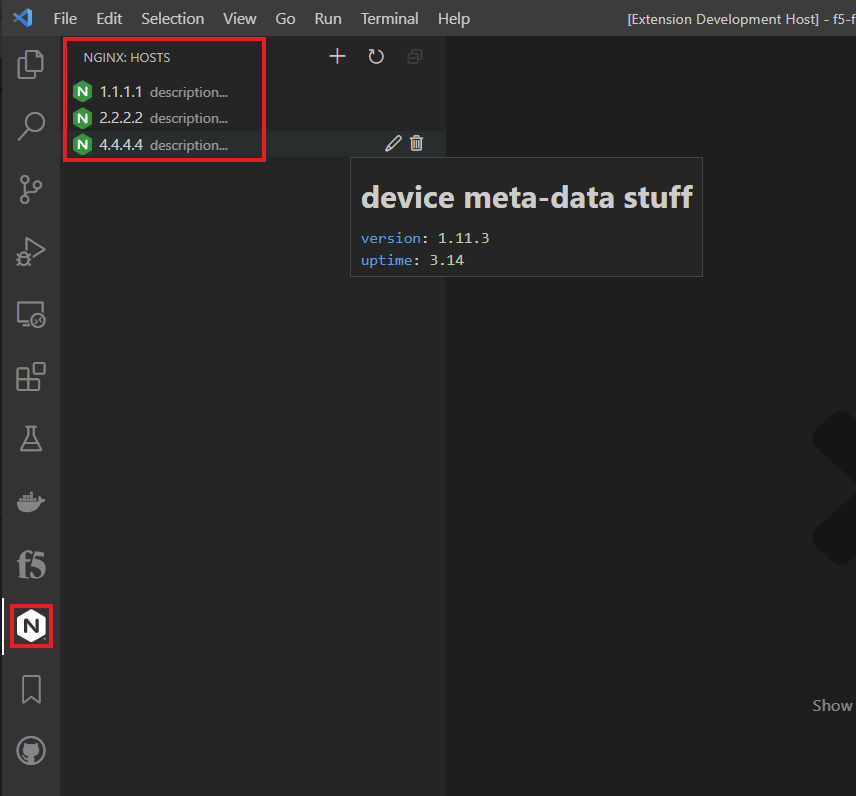
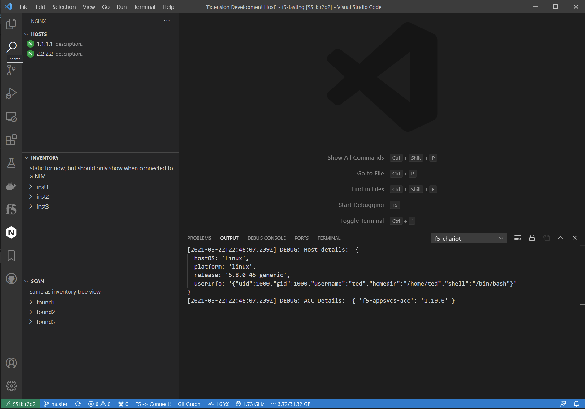

# vscode-nginx

initial draft of vscode extension for nginx, mainly nginx instance manager (NIM)

The idea is to have an extension for everything nginx, but would plugin or add on to the main vscode-f5 extension.  This would ensure that this extension has all the tools that come with the main vscode-f5 extension but not cluttered with all the tmos stuff.  So, whole new view with all nginx specific stuff.

All of this is very early stages but wanted to get a framework so others can see the options.

So, all the menu's, icons, and layout can/will change.  Looking for feedback on workflows and UI as we explore this integration more.

Also, looking at the vscode marketplace, you will see a couple of extensions that may already handle some necessary functionality (language server), so we might need to look into how they solved some of these needs.

I think the language server is going to be a big part and benefit of the config authoring process (like the irules/iapps/other nginx extensions)

## Overview

Initial integration to be done through NIM

Another shot with the different views for inventory and scanning

## Getting Started

in progress...

## Installation

None at this time

## Usage

"this is not the extension your looking for..."

## Development

Know TS?

## Support

For support, please open a GitHub issue.  Note, the code in this repository is community supported and is not supported by F5 Networks.  For a complete list of supported projects please reference [SUPPORT.md](SUPPORT.md).

## Community Code of Conduct

Please refer to the [F5 DevCentral Community Code of Conduct](code_of_conduct.md).

## License

[Apache License 2.0](LICENSE)

## Copyright

Copyright 2014-2020 F5 Networks Inc.

### F5 Networks Contributor License Agreement

Before you start contributing to any project sponsored by F5 Networks, Inc. (F5) on GitHub, you will need to sign a Contributor License Agreement (CLA).

If you are signing as an individual, we recommend that you talk to your employer (if applicable) before signing the CLA since some employment agreements may have restrictions on your contributions to other projects.
Otherwise by submitting a CLA you represent that you are legally entitled to grant the licenses recited therein.

If your employer has rights to intellectual property that you create, such as your contributions, you represent that you have received permission to make contributions on behalf of that employer, that your employer has waived such rights for your contributions, or that your employer has executed a separate CLA with F5.

If you are signing on behalf of a company, you represent that you are legally entitled to grant the license recited therein.
You represent further that each employee of the entity that submits contributions is authorized to submit such contributions on behalf of the entity pursuant to the CLA.